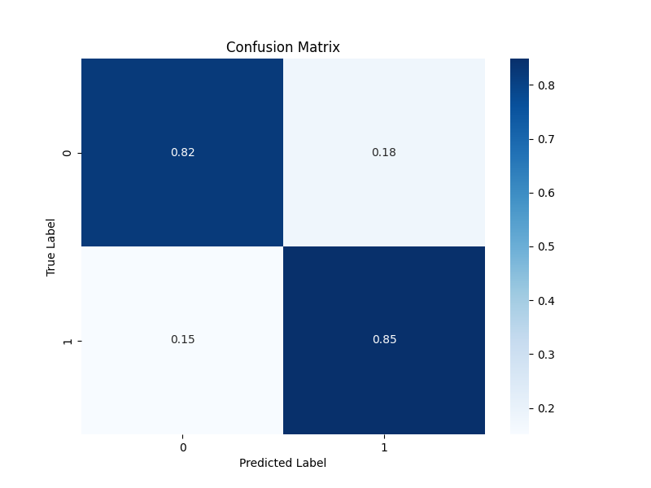

## Sentiment Analysis with LSTM

This project utilizes `Keras` and an `LSTM-based Recurrent Neural Network` to analyze sentiment from the IMDB dataset.

  
  
  <h6 align="center">
    Losses curve and Confusion matrix
  </h6>  

## Requirements

- Python 3.10 or later
- Click
- Keras 3
